# ADH Field Audit Tool — Full User Guide

*For superintendents and field staff · App version v8.48 · August 2026*
*Screenshots taken on an iPad in landscape — the layout you'll see in the field.*

---

## Table of contents

1. [What this app is](#1-what-this-app-is)
2. [Getting set up on your iPad](#2-getting-set-up-on-your-ipad)
3. [Finding your way around](#3-finding-your-way-around)
4. [Folders & projects](#4-folders--projects)
5. [Scope items (SIs)](#5-scope-items-sis)
6. [The scope item editor](#6-the-scope-item-editor)
7. [Photos](#7-photos)
8. [Tower work / multiple rooms](#8-tower-work--multiple-rooms)
9. [6-Week Look Ahead](#9-6-week-look-ahead)
10. [Manpower tracking](#10-manpower-tracking)
11. [Toolbox talks](#11-toolbox-talks)
12. [Floor plans](#12-floor-plans)
13. [Environmental conditions](#13-environmental-conditions)
14. [Contacts](#14-contacts)
15. [Reports — PDF & CSV](#15-reports--pdf--csv)
16. [Sync, offline & updates](#16-sync-offline--updates)
17. [Notifications](#17-notifications)
18. [Resources library](#18-resources-library)
19. [Admin console](#19-admin-console)
20. [Troubleshooting](#20-troubleshooting)

---

## 1. What this app is

The ADH Field Audit Tool is one app for recording everything about site conditions on your jobs:

- **Scope items** with photos, field notes, statuses and field-check codes
- **6-week look ahead** scheduling with manpower planning
- **Labor logging** against estimated hours
- **Weekly toolbox talks** with a per-project log, on-device crew sign-in, and a signed PDF you can email
- **Floor plans** with pins tied to scope items
- **Environmental (temp/humidity) tracking** from sensor data
- **Client-ready PDF reports** and a PM status CSV

It is **offline-first**: everything you do is saved on your iPad instantly and syncs to the cloud automatically when you have a connection. You never have to hit a save button.

---

## 2. Getting set up on your iPad

### Install to the Home Screen

The app runs in Safari, but install it to the Home Screen — offline mode and push notifications only work in the installed app:

1. Open the app URL in Safari.
2. Tap the **Share ⬆** button, then **Add to Home Screen**.
3. Open it from the new home-screen icon from now on.

(A hint card — *"📲 Install for offline use"* — appears the first time you visit in Safari.)

### Tell it who you are

On first launch you'll get one question: **"Who's using this device?"** Enter your first and last name and tap **Let's go →**. Your name gets stamped on every edit and photo you make from that iPad, so the team can see who did what. You can change it later by tapping the **👤 user chip** (top-right) → **Account**.

### Updates

When a new version ships, a banner appears: **"🔄 New version available — your changes are safe."** Tap **Reload Now**. Your data is never affected by updates.

---

## 3. Finding your way around

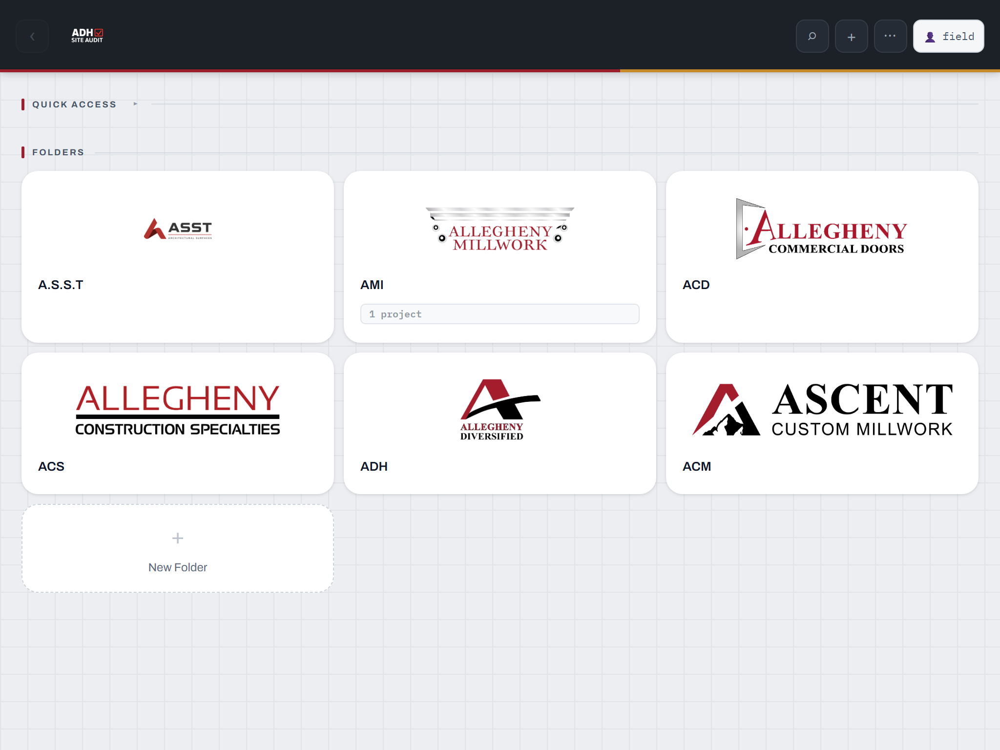

The home screen has two areas:

- **Quick Access** — cards for the **Contact Book**, **Toolbox Talk** library, **AWI Standards** (coming soon), and **Resources** (field forms, QC plans, safety programs).
- **Folders** — the six company brands: **A.S.S.T**, **AMI**, **ACD**, **ACS**, **ADH**, **ACM**. Projects live inside folders.

The layout is two panels: a **list on the left** (folders, projects, or scope items — with its own search box) and the **working view on the right**. The breadcrumb across the top always shows where you are — tap any crumb to jump back.

**Top-bar buttons (right side):**

| Button | What it does |
|---|---|
| **⌕** | Global search (also ⌘K with a keyboard) |
| **＋** | Context-aware Add — new folder at home, new project inside a folder, new scope item inside a project |
| **⋯** | Menu: 🔄 Sync, 🎨 Themes, 📤 Share (report), 🔓 Admin Login, 🔔 Notifications |
| **👤** | Account — your name, and the Admin Console if you're an admin |

### Global search

Tap **⌕** and type anything — project names, SI numbers, notes, tags, even who edited something. Results are grouped into Folders / Projects / Scope Items; tap a result to jump straight there.

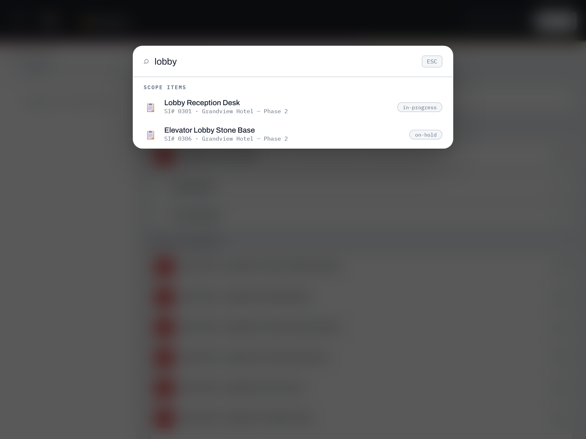

---

## 4. Folders & projects

Open a brand folder to see its projects as cards. The folder header has:

- **＋ Project** — create a project by hand (name, client, company, project type Division 4/6/8/10, auditor, date).
- **⚡ Innergy** — import a job straight from Innergy (see below).
- **📥 Import XLS** — import scope items from a delivery-style spreadsheet.
- **📋 Work Orders** — import an Innergy Work Orders spreadsheet.
- Sort controls: **A–Z**, **Date**, **Client**, and **👤 Auditor** (groups by auditor).

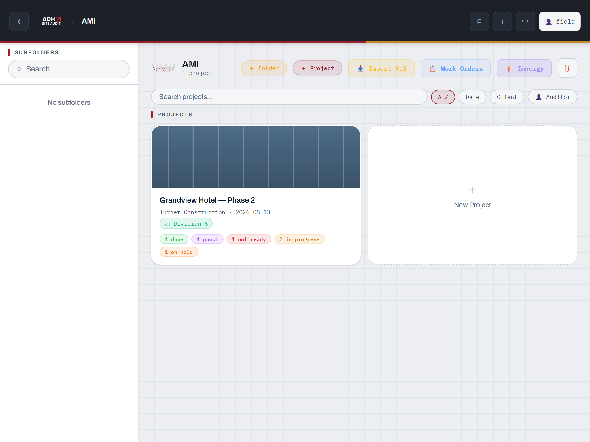

### Importing from Innergy

1. In a folder, tap **⚡ Innergy**.
2. Search the live project list by number, name or client, and tap a job.
3. Review the **Project Preview** (client, address, work-order counts, estimated hours) and tap **＋ Create Project from This**.
4. Pick which Installation work orders become scope items (all are pre-checked), optionally include other work-order types, and keep **Include estimated hours** and **Include planned dates** on — they pre-fill the labor budget and the 6-week schedule.

Innergy-linked projects are **re-checked against Innergy weekly** when you open them. If work orders were added or cancelled in Innergy, a **"⚡ Innergy Changes Detected"** dialog lets you add or remove them item by item. You can force a check anytime from the project card's **⋯ → ⚡ Compare with Innergy**.

### The project summary

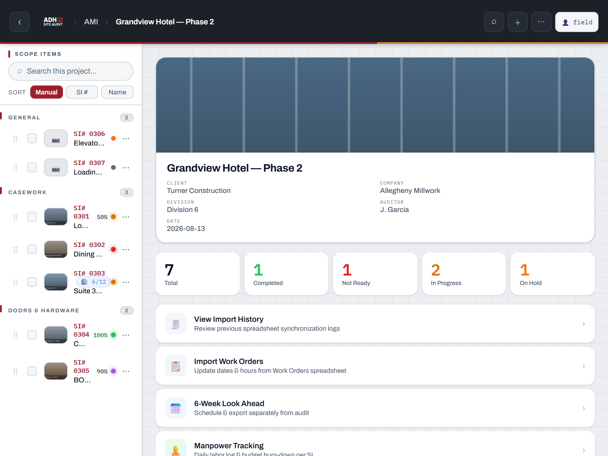

Opening a project shows the cover photo (tap **📷 Add Photo** to set one), project info, and live status counts. Below that, rows take you to every project tool: **View Import History · Import Work Orders · 6-Week Look Ahead · Manpower Tracking · Toolbox Talk Log · Floor Plan · Environmental Conditions · Activity Feed · Share Audit Report · Manage Sections · Edit Project Info**.

### Project card menu (⋯ on the card)

**📋 Duplicate Project** (with options to keep photos/notes), **📁 Move to Folder…**, **🗄️ Archive** (moves it into a collapsed ARCHIVED section), **🗑 Delete Project** (permanent — asks for confirmation), and **⚡ Compare with Innergy** on linked projects.

---

## 5. Scope items (SIs)

Scope items are the heart of the audit. They're grouped into **sections** (e.g. General, Casework, Doors & Hardware). Manage sections from the project view → **Manage Sections** (add, reorder, remove empty ones).

**Add an SI:** tap **＋** inside a project → pick the Section, enter the **SI Number** (e.g. "SI 0301") and a **Title**. New items start as **Pending**.

### Statuses

| Status | Meaning on the job |
|---|---|
| ✓ **Completed** (green) | Done |
| ◈ **Punch Ongoing** (purple) | Substantially done, punch list running |
| ◑ **In Progress** (yellow) | Being worked |
| ✕ **Not Ready** (red) | Site isn't ready for this work |
| ⏸ **On Hold** (orange) | Paused — decision or material pending |
| ◌ **Pending** (gray) | Not started / not assessed |

### The SI list (left panel)

Each row shows a photo thumbnail, SI number, title, completion %, a colored status dot, and who last edited it. Use the **Sort** row (Manual / SI # / Name) — in Manual mode you can drag items with the **⠿** handle or use the row's **⋯** menu (Move Up / Down / Top / Bottom / Move to Section / Duplicate).

**Bulk status:** tap the checkboxes on several rows and a bar appears — set them all to **✓ Done / ✕ Not Ready / ◑ In Progress / ◈ Punch / ◌ Pending** in one tap.

---

## 6. The scope item editor

Everything on one screen, top to bottom. **It auto-saves** — the "✦ auto-save" indicator at the bottom flips to "saving… / saved" as you type.

- **Title / SI# / section** — tap to rename or move to another section.
- **Status pills** — one tap sets the status.
- **Completion** — drag the slider (0–100%), or add breakdown lines ("Casework 70%, Metal trim 30%") and the overall % becomes their average automatically.
- **Field Photos** — **📷 Camera** or **🖼 Import** (see [Photos](#7-photos)).

Scroll down for the rest:

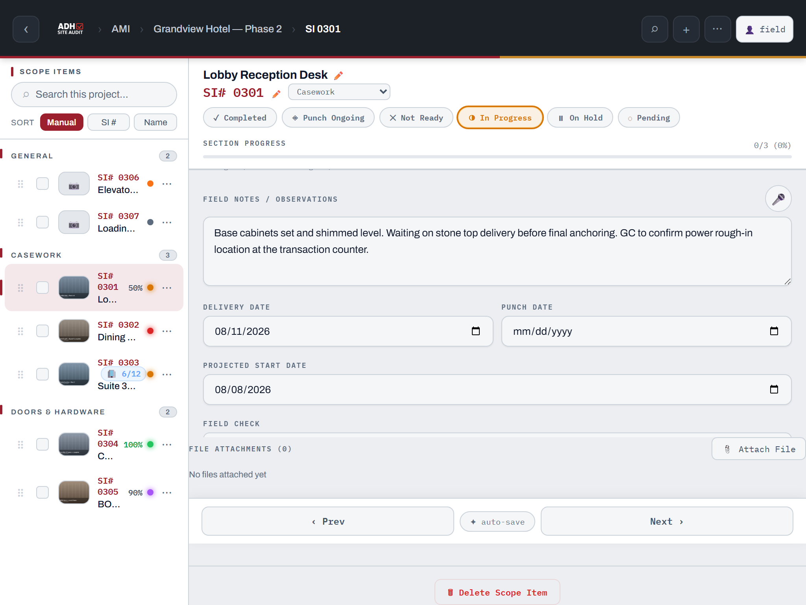

- **Field Notes / Observations** — describe conditions, what changed, what's blocking. Tap the **🎤** button to dictate instead of typing.
- **Delivery Date / Punch Date / Projected Start Date**.
- **Field Check** — pick the code that describes the dimension verification, plus an optional detail line. The codes print as color-coded badges on the report:

  | Code | Meaning | Badge color |
  |---|---|---|
  | **FC** | Field Checked | green |
  | **UFC** | Unable to Field Check | amber |
  | **NFC** | No Field Check Needed | red |
  | **HT** | "Hold to" dimension | blue |
- **Condition Tags** — quick one-tap tags: *Not Ready for Install, Layout Change, Plumbing Issue, Electrical Pending, Structural Pending, Awaiting GC, Design Change, Field Verified, Ready to Proceed, Demo Required* — plus your own custom tags.
- **Assigned To / Trade / Due Date**.
- **Labor Log** — log crew days against this SI (see [Manpower](#10-manpower-tracking)).
- **Tower Work / Multiple Rooms** — per-room tracking (see [next section](#8-tower-work--multiple-rooms)).
- **File Attachments** — attach PDFs, spreadsheets, docs, etc.
- **‹ Prev / Next ›** — walk the whole project item by item without going back to the list.

> ### ⚠️ Required before you can export a PDF
> Every scope item that is **not** Completed or Punch Ongoing must have:
> **1) a Field Check code, 2) Field Notes, and 3) at least one photo.**
> If anything's missing, export shows **"⚠ Cannot Export — Required Fields Missing"** with an **Open ›** button next to each offender, and the missing fields are outlined in red. Fill them in as you walk the job and export will just work.

---

## 7. Photos

- **📷 Camera** opens the iPad camera; **🖼 Import** pulls from your photo library (multi-select works).
- Photos save to the device instantly and upload to the cloud in the background — you can shoot all day with no signal and it catches up later.
- Each tile shows the date taken. Tap a photo to view it full screen.
- **Markup:** tap a photo's **⋯ → 🖊️ Markup** to draw on it — pen, arrow, box, and text in six colors, with undo. Saving flattens your annotations into the photo and re-syncs it.
- **Delete:** photo **⋯ → 🗑 Delete Photo**.
- The **project cover photo** is set from the project summary (Add Photo / Change / Remove).

---

## 8. Tower work / multiple rooms

For hotel/tower jobs where one scope item covers many rooms:

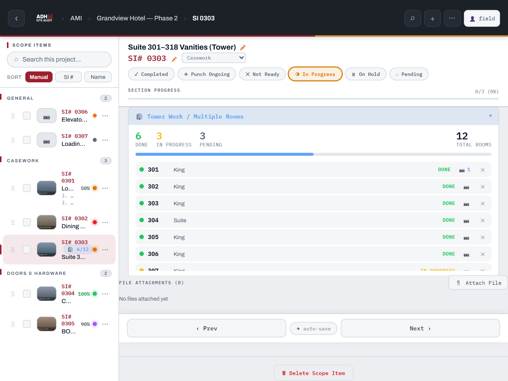

1. In the SI editor, open **🏢 Tower Work / Multiple Rooms** and tap to enable.
2. Add rooms one at a time (**Room # + Type** — King, Queen, Suite, Corridor, etc.) or in bulk with a range like **`101-110`** or **`201,203,205`**.
3. **Tap a room row to cycle its status:** Pending → In Progress → Done.
4. Tap a room's **📷** to attach photos to that specific room (camera or import — same pipeline as field photos).

The SI list shows a **🏢 done/total** badge, and room detail (including photos) flows into the PDF and CSV reports.

---

## 9. 6-Week Look Ahead

From the project summary → **6-Week Look Ahead**.

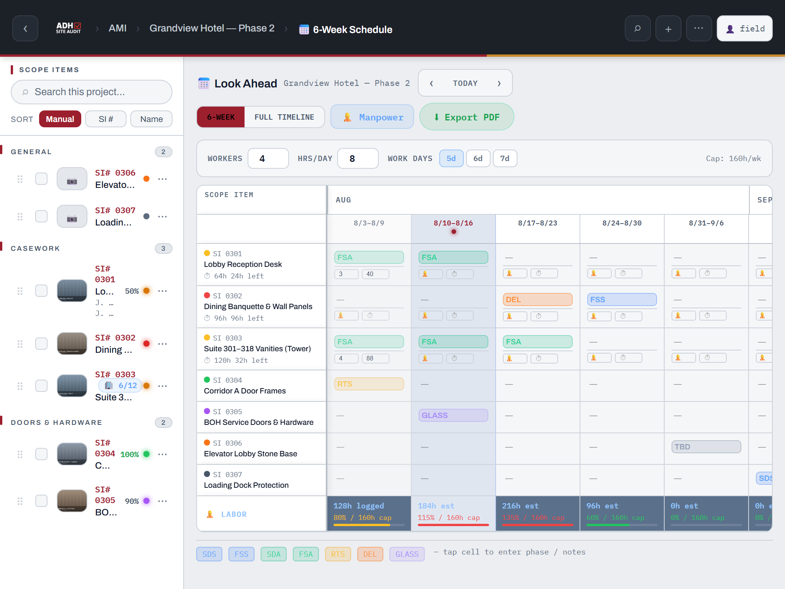

- The grid is scope items × weeks. **Tap any cell and type** — phase codes color themselves: **SDS, FSS** (blue), **SDA, FSA** (green), **RTS** (amber), **DEL** (orange), **GLASS** (violet), plus MEP, TBD, DELAYED.
- **6-WEEK** mode shows a sliding six-week window (**‹ TODAY ›** to move); **FULL TIMELINE** shows the whole job.
- Toggle **👷 Manpower** to plan labor: set **Workers / Hrs-Day / Work Days** for the weekly capacity cap, enter per-cell workers/hours, and watch the **👷 LABOR** row at the bottom — the bar goes yellow at 80% of capacity and red over 100%.
- **⬇ Export PDF** makes a landscape schedule PDF — presets for **Current 6 Weeks**, **Past 4 + Next 8**, or **Full Project**, with an optional manpower row.

Innergy imports pre-fill the schedule from planned start dates.

---

## 10. Manpower tracking

Two ways to log labor, one shared record:

- **In the SI editor → Labor Log:** log a day (date, workers, hrs/worker, note). A burn-down bar shows hours used against that SI's estimate and warns when you're over budget.
- **Project summary → Manpower Tracking:** the whole-project dashboard.

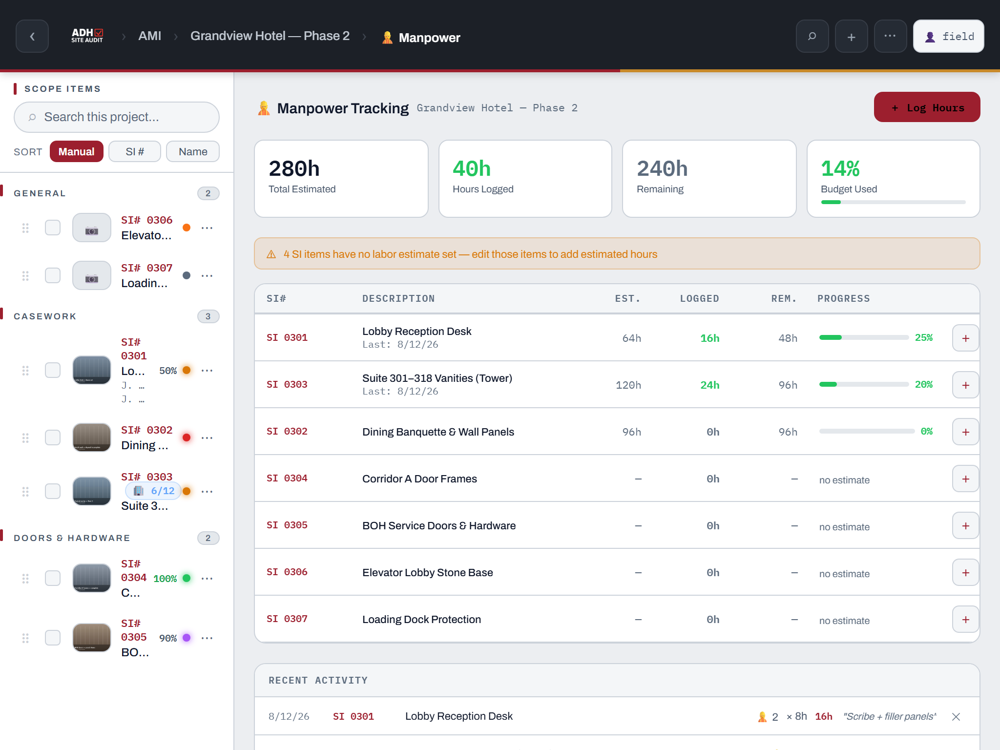

Summary cards show **Total Estimated / Hours Logged / Remaining / Budget Used**. The table lists every SI with estimate, logged, remaining and progress — tap **＋** on a row (or **+ Log Hours** top-right) to log a day. Items with no estimate are flagged so you can add estimated hours to them.

---

## 11. Toolbox talks

- **The library** (home → Quick Access → **🦺 Toolbox Talk**): all 52 weekly talks as printable PDFs. Tap a row to open the talk, tap **✍ Sign** to run it right on the device, or download it.
- **The log** (project summary → **Toolbox Talk Log**): record the talks you actually held on this job.

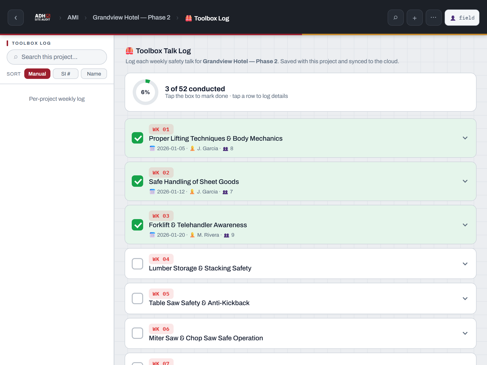

Tap the **checkbox** to mark a week done (today's date auto-fills), or tap the row to log details: **Date conducted, Supervisor, Attendees, Notes**, plus **📖 Read talk** and **✍ Sign & Send PDF**. The progress ring tracks your "N of 52 conducted." The log syncs with the project.

### Signing a talk on the device

From either place, **✍ Sign** opens the sign-in sheet: read the talk with the crew, then pass the device around — each person prints their name and signs with a finger or stylus. When everyone has signed, **📤 Send signed PDF** builds one PDF (the full talk with the crew sign-in record appended) and opens the share sheet to email it or save it to Files; on desktop it downloads.

Two things to know:

- **Signatures stay on the device that collected them.** They are saved locally (they survive closing the app) but never sync to the cloud, so one crew's sheet can never merge into another device's. The emailed PDF is the official record.
- Sending from a project's log also updates that week's synced log automatically: marked **done**, with the date, supervisor, and attendee count filled from the sheet.

The sheet keeps its signatures until you **Clear** it, so you can reopen it to add a late arrival and send again.

---

## 12. Floor plans

Project summary → **Floor Plan**.

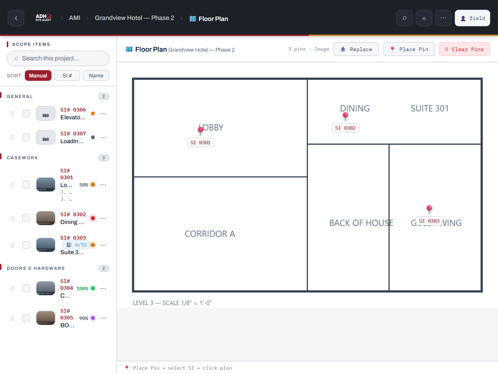

1. **📤 Upload Plan** — a photo/image works best (PDF works too, but on iPad pins are easier on an image).
2. Tap **📍 Place Pin** → pick the scope item → tap the plan where it goes.
3. Pins show the SI number. Tap a pin to jump to that SI (**Open SI**) or remove it. One pin per SI — re-pinning moves it.

The plan with numbered pins and a legend can be included as a page in the PDF report. *The plan image stays on your device — it's too large to sync, so add it on the iPad you report from.*

---

## 13. Environmental conditions

Project summary → **Environmental Conditions** — for temp/humidity documentation on acclimatization-sensitive work:

- **📊 Import CSV** from your sensor app (columns: timestamp, temperature, humidity) — you get zoomable charts per sensor with min/avg/max.
- **📷 Screenshot** — or just attach screenshots from the sensor app.
- Set acceptable ranges with the zone presets (**Z1 / Z2 / Z3**) or manual min/max. Readings outside the range are flagged (**⚠ N violations**) and the chart highlights where they happened.

Charts and violation flags flow into the PDF report's Environmental Conditions page.

---

## 14. Contacts

Home → Quick Access → **📇 Contact Book**. A shared, synced contact list: add contacts by hand, or import from **CSV / vCard (.vcf) / Excel (.xlsx)**. Export back out as VCF or Excel. Available from the bottom nav on phones.

---

## 15. Reports — PDF & CSV

Open the project, then **⋯ → 📤 Share**. This is the **Report Generator** — a live preview of the exact PDF on the right, options on the left.

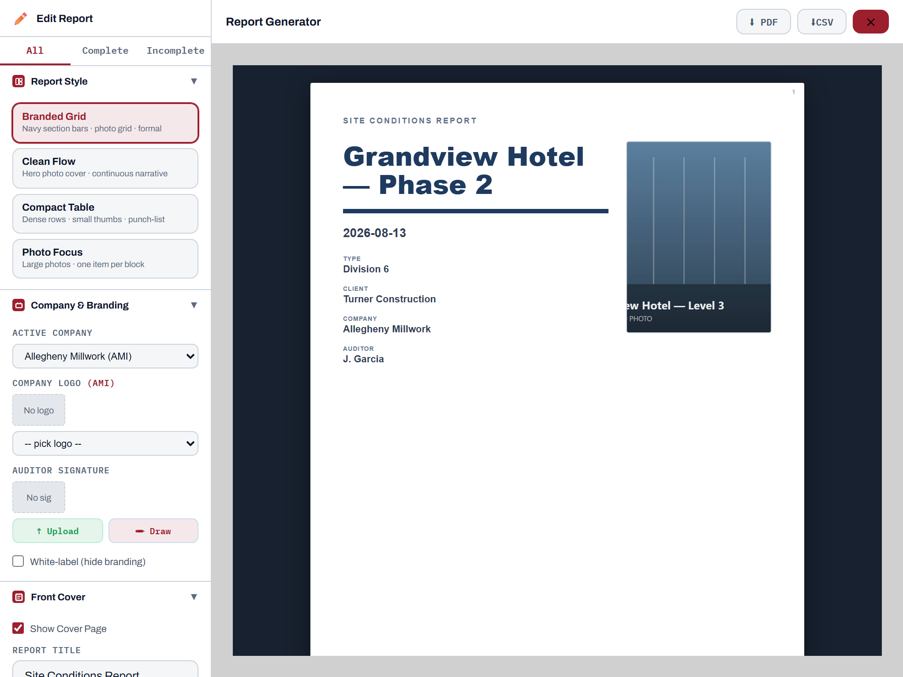

**Options, top to bottom:**

- **All / Complete / Incomplete** — filter which scope items go in the report.
- **Report Style** — four layouts: **Branded Grid** (formal, navy section bars), **Clean Flow** (hero photo cover, narrative), **Compact Table** (dense punch-list), **Photo Focus** (large photos).
- **Company & Branding** — pick the active company, its logo, and your **auditor signature** (upload an image or draw it with your finger). The signature prints on a Report Sign-Off page. **White-label** hides all branding.
- **Front Cover** — toggle the cover page and set the report title (default "Site Conditions Report").
- **Images** — size (Small → Extra Large), quality, square crops.
- **Include in Report** — check what to include: Photos, Timestamps on Photos, Field Notes, Condition Tags, Completion %, Tower Work Rooms, Labor Log, Attachments List, Floor Plan Page, Environmental Charts, Page Numbers.

**⬇ PDF** builds the report. On iPad you'll get a **⬆ Share / Save PDF** sheet — AirDrop it, save to Files, or email it straight to the PM. Remember the [required-fields rule](#6-the-scope-item-editor): incomplete items must each have a field check, notes, and a photo.

**⬇CSV** exports the **PM status report** — a spreadsheet with the project header, a SUMMARY block (status counts, completion %, tower rooms, man-hours logged/budgeted/remaining), a full SCOPE ITEMS table (one row per SI with every field), plus TOWER ROOMS and LABOR LOG detail blocks. Opens clean in Excel.

---

## 16. Sync, offline & updates

**You don't manage sync — it manages itself.** Edits push to the cloud a couple of seconds after you make them, and the app pulls other people's changes every 15 seconds while open.

What you'll see:

- **Offline:** a banner — *"⚠️ Offline Mode — Changes will sync when reconnected."* Keep working; photos and edits queue on the iPad and flush automatically when signal returns.
- **⋯ → 🔄 Sync** — a manual push/pull if you want to force it (e.g. right before opening the job trailer laptop). Inside a project it syncs that project; elsewhere it pulls everything.
- A **dot on the sync button** means changes arrived while you were mid-edit — the screen refreshes itself as soon as you pause.
- **No conflict pop-ups, ever.** Merging is automatic (newest edit per field wins; deletions stay deleted).
- **Update banner:** *"🔄 New version available — your changes are safe"* → tap **Reload Now**.

---

## 17. Notifications

**⋯ → 🔔 Notifications** toggles them on (Safari will ask permission the first time). You'll receive **direct messages from the office/admin** — e.g. "Missing daily report — please submit today's report." Messages also pop up in-app (**"🔔 Messages for you"**) — tap **✓ Got it** to acknowledge, which sends a read receipt back.

> **iPad note:** push only works when the app is installed to the Home Screen (iOS 16.4+). In-browser you'll still get the in-app popups.

---

## 18. Resources library

Home → Quick Access → **📂 Resources** — the field document library, always available offline-friendly in the app:

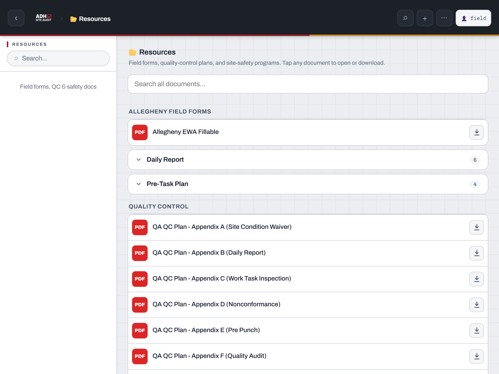

- **Allegheny Field Forms** — EWA fillable, Daily Report (DOCX + PDF), Pre-Task Plan.
- **Quality Control** — the Millwork QC Plan and Appendices A–F (Site Condition Waiver, Daily Report, Work Task Inspection, Nonconformance, Pre Punch, Quality Audit).
- **Site Safety** — current-year programs: Cold Stress, Emergency Action, HazCom, Heat Illness (AZ/CA/NV), Hurricane, Silica, Tornado.

Tap a row to open; the ⬇ button downloads. The search box covers everything.

---

## 19. Admin console

For admins only (⋯ → **🔓 Admin Login**). After signing in, open it from **👤 → 🛠 Admin Console**.

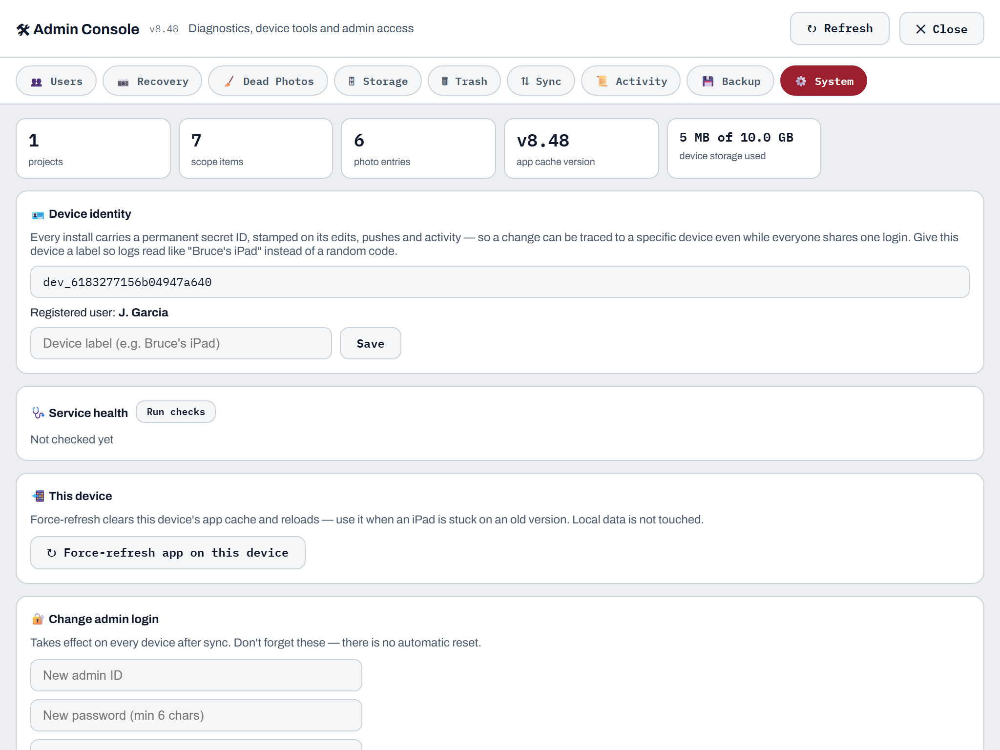

The tabs: **👥 Users** (every registered device, who's online, what app version each iPad runs — old versions highlighted — plus direct messages with read receipts), **📷 Recovery** (restore photos from cloud storage), **🧹 Dead Photos**, **🗄 Storage**, **🗑 Trash** (restore deleted projects/SIs, ~90-day hold), **⇅ Sync** (what this device still owes the cloud, force push/pull), **📜 Activity** (who did what, across projects), **💾 Backup** (download/restore a full JSON backup), and **⚙️ System** (device identity & label, service health checks, force-refresh this device, change the admin login).

Handy to know even if you're not an admin: if your iPad is stuck on an old version, an admin can see it in Users and you can fix it via System → **Force-refresh app on this device** (your data is untouched).

---

## 20. Troubleshooting

| Symptom | What's going on / what to do |
|---|---|
| *"⚠️ Photo saved on this device — cloud upload pending"* | No/poor signal at capture time. It retries automatically on the next sync — nothing to do. |
| PDF export blocked — *"Cannot Export — Required Fields Missing"* | Tap **Open ›** next to each listed item and fill the red-outlined fields (field check, notes, photo). |
| Someone else's changes aren't showing | The app pulls every 15 s while open. Force it: **⋯ → 🔄 Sync**. |
| App looks outdated / missing a feature | Wait for the update banner and tap **Reload Now**, or (admin) System → Force-refresh. |
| *"Offline Mode"* banner won't clear | Check the iPad's connection; everything you did while offline syncs the moment you're back. |
| Accidentally deleted a project | An admin can restore it from **Admin Console → 🗑 Trash** (kept ~90 days). |
| Floor plan missing on another iPad | Plans don't sync (too large) — upload the plan on the iPad you report from. |

---

*Questions or ideas? Ping the office — the app ships updates frequently and small requests land fast.*
