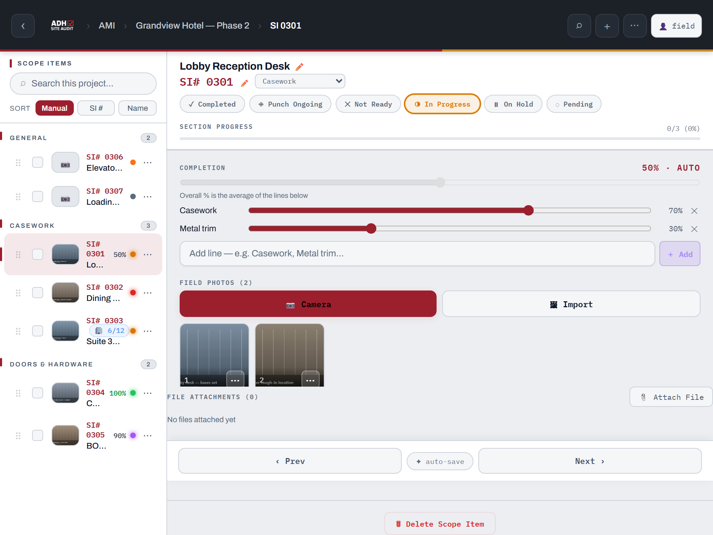

# ADH Field Audit Tool — Quick Guide

*The one-pager for supers. Full details: [FULL-GUIDE.md](FULL-GUIDE.md) · v8.48*

---

## First time on this iPad

1. Open the app in Safari → **Share ⬆ → Add to Home Screen** → always launch from the icon.
2. Enter your name when asked — it stamps your edits so the team knows who did what.
3. That's it. **Everything auto-saves and auto-syncs.** No signal? Keep working — it catches up later.

---

## The daily walk

1. **Open your project** (brand folder → project card).
2. **Walk the job, item by item** — tap an SI in the left list, or use **‹ Prev / Next ›** to step through:
   - Tap a **status pill**: ✓ Completed · ◈ Punch Ongoing · ◑ In Progress · ✕ Not Ready · ⏸ On Hold · ◌ Pending
   - **📷 Camera** — shoot what you see (draw on photos via ⋯ → Markup)
   - **Field Notes** — type it or tap **🎤** and dictate
   - Set the **Field Check** code — **FC** Field Checked · **UFC** Unable to Field Check · **NFC** No Field Check Needed · **HT** "Hold to" dimension — and any **Condition Tags**
   - Drag the **Completion %** slider
3. **Log labor** — SI editor → Labor Log → date, workers, hrs/worker → **＋ Log**.
4. **Tower job?** Open **🏢 Tower Work**, tap room rows to cycle Pending → In Progress → Done, 📷 per room.
5. **Weekly:** run the toolbox talk (project → Toolbox Talk Log → **✍ Sign & Send PDF** — crew signs on the device, then email the signed PDF; the log marks itself done) and update the **6-Week Look Ahead** (tap a cell, type the phase — SDS/FSS/FSA/RTS/DEL…).

> ### ⚠️ The report rule
> Every item that isn't **Completed** or **Punch Ongoing** needs a **Field Check + Field Notes + at least one photo** before the PDF will export. Fill them in as you walk and export just works.

---

## Sending the report

1. In the project: **⋯ (top-right) → 📤 Share**.
2. Pick a style (**Branded Grid** is the formal default), check what to include.
3. **⬇ PDF** → **⬆ Share / Save PDF** → AirDrop, Files, or email to the PM.
4. Need a spreadsheet instead? **⬇CSV** = full PM status report for Excel.

---

## Fast answers

| Need to… | Do this |
|---|---|
| Find anything, anywhere | **⌕** top-right → type SI #, name, note text |
| Add a project / scope item | **＋** top-right (context-aware) |
| Pull a job from Innergy | Folder → **⚡ Innergy** → pick job → **＋ Create Project from This** |
| Force a sync | **⋯ → 🔄 Sync** |
| Pin work on a plan | Project → Floor Plan → **📍 Place Pin** → pick SI → tap plan |
| Track hours vs. budget | Project → **Manpower Tracking** |
| Get blank forms / safety programs | Home → **📂 Resources** |
| Update the app | Banner appears → **Reload Now** (your data is safe) |
| Photo says "upload pending" | Ignore it — it uploads itself when you have signal |

**Golden rules:** work from the Home-Screen app, keep your name set, and never worry about saving — it already did.
